<div align="center">

  

  <br><br>

  [](https://wazuh.com/)
  [](https://shuffler.io/)
  [](https://tailscale.com/)
  [](https://www.virustotal.com/)
  [](https://attack.mitre.org/)
  [-16a34a?style=for-the-badge&logo=shield&logoColor=white)](#-automated-threat-response-pipeline)
  [](LICENSE)

  <br>

  <p align="center">
    <strong>A distributed 5-node security operations and automated incident response ecosystem.</strong><br>
    Engineered with zero-trust mesh networking, real-time log ingestion, correlation decoders, threat intelligence enrichment, and automated endpoint containment.
  </p>

  <p align="center">
    <a href="#-architecture-overview"><strong>Architecture</strong></a> •
    <a href="#-team-roles--contributions"><strong>Team Roles</strong></a> •
    <a href="#-attack-scenarios--detection-matrix"><strong>Attack Scenarios</strong></a> •
    <a href="#-soar-playbook-workflows"><strong>SOAR Playbooks</strong></a> •
    <a href="#-visual-evidence-gallery"><strong>Evidence Gallery</strong></a> •
    <a href="#-quick-start--reproduction"><strong>Quick Start</strong></a>
  </p>

</div>

---

## 📑 Table of Contents

- [Overview & Key Highlights](#-overview--key-highlights)
- [Architecture Overview](#-architecture-overview)
- [Team Roles & Contributions](#-team-roles--contributions)
- [Distributed Tailnet Mesh Topology](#-distributed-tailnet-mesh-topology)
- [Attack Scenarios & Detection Matrix](#-attack-scenarios--detection-matrix)
- [Automated Threat Response Pipeline](#-automated-threat-response-pipeline)
- [Live SOC Simulation Feed](#-live-soc-simulation-feed)
- [SOAR Playbook Workflows](#-soar-playbook-workflows)
- [MITRE ATT&CK Matrix](#-mitre-attck-matrix)
- [Visual Evidence Gallery](#-visual-evidence-gallery)
  - [1. Wazuh SIEM Deployment & Hardening](#1-wazuh-siem-deployment--hardening)
  - [2. Zero-Trust Tailscale Mesh Setup](#2-zero-trust-tailscale-mesh-setup)
  - [3. Endpoint Enrollment & Monitoring](#3-endpoint-enrollment--monitoring)
  - [4. Red-Team Attack Simulation](#4-red-team-attack-simulation)
  - [5. Wazuh Real-Time Threat Detections](#5-wazuh-real-time-threat-detections)
  - [6. Shuffle SOAR & VirusTotal Integration](#6-shuffle-soar--virustotal-integration)
  - [7. Active Response & Host Containment](#7-active-response--host-containment)
- [Quick Start & Reproduction](#-quick-start--reproduction)
- [Repository Structure](#-repository-structure)
- [Author & Credits](#-author--credits)

---

## 🌟 Overview & Key Highlights

This repository contains the complete documentation, configuration code, detection rules, SOAR playbooks, and evidence artifacts for a **5-person distributed cybersecurity operations lab**. 

Instead of operating inside a single local hypervisor, our team connected **5 separate home labs and cloud instances across different physical locations** into a unified, zero-trust private network.

```
       ┌────────────────────────────────────────────────────────────────────────┐
       │                     DISTRIBUTED INCIDENT LIFECYCLE                     │
       └────────────────────────────────────────────────────────────────────────┘
            [ Red Team Simulation ] ──▶ External Attackers launch TTPs
                      │
                      ▼
            [ Monitored Endpoints ] ──▶ Linux & Windows Agents forward telemetry
                      │
                      ▼ (Encrypted WireGuard Mesh · 100.x Subnet)
            [ Wazuh SIEM Manager  ] ──▶ Real-time log decoding & rule correlation
                      │
                      ▼ (Webhook JSON Payload · Sub-second latency)
            [ Shuffle SOAR Engine ] ──▶ VirusTotal API lookup & decision tree
                      │
                      ▼ (Authenticated JWT Wazuh REST API)
            [ Active Containment  ] ──▶ Dynamic iptables drop & netsh host isolation
```

### Key Engineering Capabilities
- 🌐 **Zero-Trust Mesh Networking**: Replaced traditional port-forwarding with an encrypted **Tailscale WireGuard mesh** providing a flat `100.x` IPv4 space with owner-enforced device access control.
- ⚡ **Centralized SIEM Management**: Deployed **Wazuh 4.14** from an all-in-one appliance to ingest Syslog, Sysmon, Auditd, and Windows Event logs from disparate endpoints.
- 🔄 **SOAR Automation & Playbooks**: Configured **Shuffle SOAR** on Docker to listen for qualifying alert webhooks, parse indicators of compromise (IOCs), query threat intelligence feeds, and orchestrate responses.
- 🛡️ **Sub-Second Bi-Directional Containment**: Created automated active-response actions that dynamically block attacker IPs via `iptables` on Linux hosts and isolate endpoints via `netsh` on Windows systems in **$< 1.5$ seconds**.

---

## 🏗️ Architecture Overview

<div align="center">
  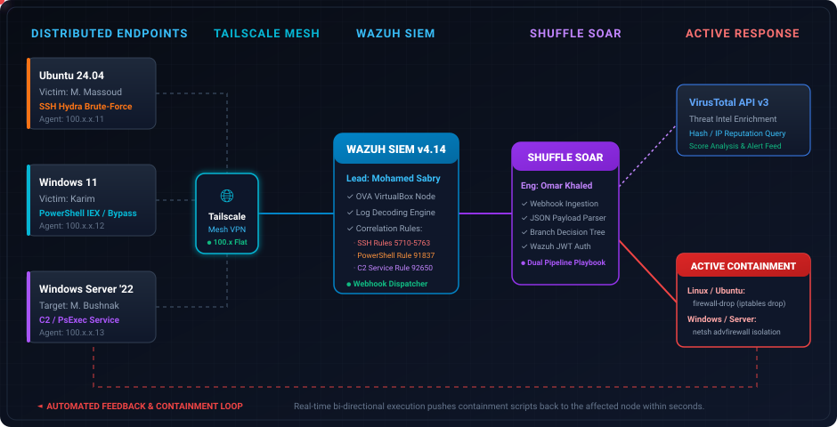
</div>

### Dataflow Specifications
1. **Agent Telemetry (Port 1514/TCP)**: Victim endpoints continuously stream OSSEC-encrypted audit and event logs to the central Wazuh Manager over their private Tailscale addresses (`100.64.0.10`).
2. **Alert Triggering (Rule Engine)**: Custom XML correlation rules evaluate log streams against frequency thresholds, regex patterns, and MITRE ATT&CK criteria.
3. **Webhook Dispatch (HTTP/JSON)**: `ossec-integratord` packages alerts of severity Level $\ge 6$ and dispatches JSON payloads to the Shuffle SOAR webhook listener on port `3001`.
4. **Threat Intelligence & Response Loop**: Shuffle extracts IPs and hashes, conducts VirusTotal API lookups, authenticates against the Wazuh REST API via JWT, and issues containment instructions back to the affected agent.

---

## 👥 Team Roles & Contributions

| Member | Lab Role | Core Responsibilities | Target / Node |
| :--- | :--- | :--- | :--- |
| **Mohamed Sabry**<br>([@0xsabry](https://github.com/0xsabry)) | **Project Lead & SIEM Architect** | • Wazuh OVA manager deployment & VM hardening<br>• Custom detection rules & OSSEC configuration<br>• Webhook integration & active-response binding | `wazuh-manager`<br>`100.64.0.10` |
| **Omar Khaled** | **SOAR Automation Engineer** | • Shuffle SOAR Docker deployment & canvas design<br>• Inbound webhook listener & JSON payload parsing<br>• VirusTotal API v3 integration & JWT API callbacks | `shuffle-soar`<br>`100.64.0.14` |
| **Mohamed Massoud** | **Linux Target & Red Team** | • Ubuntu Server 24.04 LTS endpoint enrollment<br>• Nmap service recon & Hydra SSH brute-force simulation<br>• Verification of Linux `firewall-drop` iptables blocking | `ubuntu-victim`<br>`100.64.0.11` |
| **Karim** | **Windows Target & Red Team** | • Windows 11 endpoint enrollment & Sysmon integration<br>• ExecutionPolicy bypass & IEX download cradle testing<br>• Verification of Windows `netsh` host isolation | `win11-victim`<br>`100.64.0.12` |
| **Mohamed Bushnak** | **Server Target & Red Team** | • Windows Server 2022 endpoint enrollment<br>• PsExec-style remote execution & rogue service creation<br>• Verification of Windows Server C2 service containment | `win2022-srv`<br>`100.64.0.13` |

---

## 🌐 Distributed Tailnet Mesh Topology

```
┌────────────────────────────────────────────────────────────────────────────────────────┐
│                        PRIVATE TAILSCALE ZERO-TRUST MESH (100.64.0.0/10)               │
├────────────────────┬────────────────────┬─────────────────────┬────────────────────────┤
│ Node Name          │ Operating System   │ Assigned Tailnet IP │ Role in Pipeline       │
├────────────────────┼────────────────────┼─────────────────────┼────────────────────────┤
│ wazuh-manager      │ Linux (Debian)     │ 100.64.0.10         │ SIEM Core / Controller │
│ ubuntu-victim      │ Ubuntu 24.04 LTS   │ 100.64.0.11         │ SSH Target Endpoint    │
│ win11-victim       │ Windows 11 Ent     │ 100.64.0.12         │ PowerShell Target      │
│ win2022-srv        │ Windows Server '22 │ 100.64.0.13         │ C2 / Service Target    │
│ shuffle-soar       │ Linux (Docker)     │ 100.64.0.14         │ SOAR Orchestration Hub │
└────────────────────┴────────────────────┴─────────────────────┴────────────────────────┘
```

> [!NOTE]
> All attacker workstations were hosted in local, un-routed subnets outside the Tailscale mesh to maintain authentic offensive-to-defensive boundaries.

---

## 🎯 Attack Scenarios & Detection Matrix

```
┌────────────────────────────────────────────────────────────────────────────────────────────────────────┐
│                                       ATTACK & DETECTION MATRIX                                        │
├──────────────────┬──────────────────────┬──────────────────────┬─────────────┬─────────────────────────┤
│ Attack Scenario  │ Offensive Technique  │ Log Source / Event   │ Wazuh Rules │ Active Containment      │
├──────────────────┼──────────────────────┼──────────────────────┼─────────────┼─────────────────────────┤
│ 01. SSH Brute    │ Hydra Dictionary     │ /var/log/auth.log    │ 5710, 5712, │ Rule 651: firewall-drop │
│     Force Attack │ Password Guessing    │ (sshd failures)      │ 5763 (Lv10) │ Attacker IP dropped     │
├──────────────────┼──────────────────────┼──────────────────────┼─────────────┼─────────────────────────┤
│ 02. Suspicious   │ ExecutionPolicy      │ PowerShell/Oper.     │ 67027,      │ Rule 657: netsh isolate │
│     PowerShell   │ Bypass + IEX Cradle  │ Event ID 4104        │ 91837 (Lv12)│ Endpoint isolated       │
├──────────────────┼──────────────────────┼──────────────────────┼─────────────┼─────────────────────────┤
│ 03. Command &    │ PsExec Remote        │ System.evtx          │ 92650 (Lv12)│ Rule 657: netsh isolate │
│     Control (C2) │ Service Installation │ Event ID 7045        │             │ Inbound/Outbound cut    │
└──────────────────┴──────────────────────┴──────────────────────┴─────────────┴─────────────────────────┘
```

### Scenario 1: SSH Brute-Force Credential Attack (Ubuntu)
- **Vector**: Remote SSH password spraying using `hydra` and `rockyou.txt`.
- **Detection**: Log decoders matched repeated authentication failures within a 120-second sliding window, triggering Rule `5763` (*Maximum authentication attempts exceeded*).
- **Mitigation**: Triggered active-response command `firewall-drop.sh`, immediately writing an `iptables` drop rule for the attacker's IP.

### Scenario 2: Suspicious PowerShell Download Cradle (Windows 11)
- **Vector**: Execution policy bypass paired with an in-memory `IEX (New-Object Net.WebClient).DownloadString(...)` payload cradle.
- **Detection**: Captured via Script Block Logging (Event 4104), triggering Rule `91837` (*Suspicious PowerShell string execution*).
- **Mitigation**: Triggered active-response command `netsh.cmd`, placing the host network stack into isolated quarantine.

### Scenario 3: C2 / Remote Service Creation (Windows Server 2022)
- **Vector**: PsExec-style lateral execution installing a persistence service (`sc.exe create ...`).
- **Detection**: Windows System Event 7045 detected, triggering Rule `92650` (*New Windows Service Created - Severity Level 12*).
- **Mitigation**: Automated SOAR playbook quarantined the host and notified analysts.

---

## ⚡ Automated Threat Response Pipeline

<div align="center">
  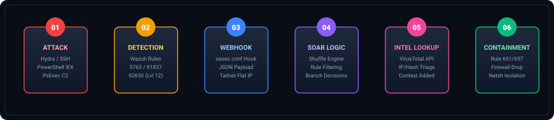
</div>

---

## 💻 Live SOC Simulation Feed

<div align="center">
  
</div>

---

## 🔄 SOAR Playbook Workflows

The **Shuffle SOAR** playbook executes a multi-stage decision pipeline upon receiving Wazuh alerts:

```
                      ┌─────────────────────────────────┐
                      │ Inbound Webhook Listener (JSON) │
                      └────────────────┬────────────────┘
                                       │
                                       ▼
                      ┌─────────────────────────────────┐
                      │   Field Parser & Normalizer     │
                      └────────────────┬────────────────┘
                                       │
                    ┌──────────────────┴──────────────────┐
                    │                                     │
           [ Rule == 5763 (SSH) ]               [ Rule == 91837 / 92650 ]
                    │                                     │
                    ▼                                     ▼
        ┌───────────────────────┐             ┌───────────────────────┐
        │ Direct Active-Response│             │ VirusTotal API v3     │
        │ Command Initiation    │             │ Threat Intelligence   │
        └───────────┬───────────┘             └───────────┬───────────┘
                    │                                     │
                    └──────────────────┬──────────────────┘
                                       │
                                       ▼
                      ┌─────────────────────────────────┐
                      │ Wazuh REST API JWT Auth (55000) │
                      └────────────────┬────────────────┘
                                       │
                                       ▼
                      ┌─────────────────────────────────┐
                      │ Active Response Containment Run │
                      └─────────────────────────────────┘
```

1. **Webhook Ingestion**: Wazuh pushes alert JSON containing Rule ID, Timestamp, Agent ID, Source IP, and Raw Log.
2. **Dynamic Branching**: Rules are classified into direct containment (e.g. active brute-force) or enrichment paths.
3. **Intel Enrichment**: VirusTotal checks the reputation of external IPs and file hashes.
4. **Authenticated Callback**: Shuffle generates a bearer JWT via `/security/user/authenticate` and calls `/active-response` on the Wazuh Manager.
5. **Auditable Logging**: Every execution record is preserved in Shuffle execution logs and Wazuh `active-responses.log`.

---

## 🗺️ MITRE ATT&CK Matrix

| Tactic | Technique ID | Technique Name | Detection Rule | Lab Scenario |
| :--- | :--- | :--- | :--- | :--- |
| **Initial Access** | `T1110.001` | Password Guessing | Wazuh Rule `5710` / `5763` | Hydra SSH Attack (Ubuntu) |
| **Credential Access** | `T1110.003` | Password Spraying | Wazuh Rule `5763` | Hydra SSH Attack (Ubuntu) |
| **Execution** | `T1059.001` | PowerShell Scripting | Wazuh Rule `91837` | Download Cradle (Win 11) |
| **Defense Evasion** | `T1562.001` | Disable or Modify Tools | Wazuh Rule `67027` | ExecutionPolicy Bypass |
| **Persistence** | `T1543.003` | Windows Service Creation | Wazuh Rule `92650` | PsExec Service Install |
| **Lateral Movement** | `T1021.002` | SMB / Windows Admin Shares | Wazuh Rule `92650` | Remote Service Execution |
| **Command & Control** | `T1071.001` | Web Protocols (HTTP C2) | VirusTotal Integration | Payload Fetch & Beaconing |

---

## 📸 Visual Evidence Gallery

### 1. Wazuh SIEM Deployment & Hardening
<table>
  <tr>
    <td width="50%" align="center">
      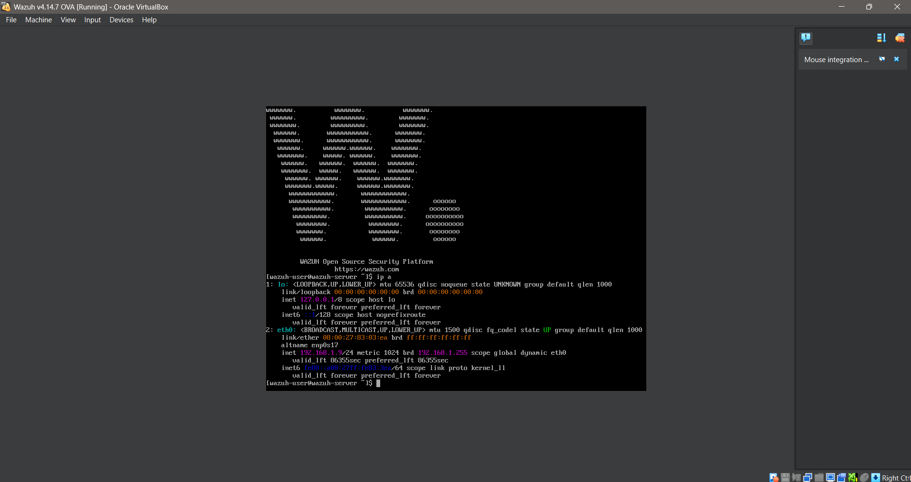<br>
      <sub><strong>01 · Appliance Deployment</strong><br>Importing the official Wazuh all-in-one OVA (v4.14) into VirtualBox.</sub>
    </td>
    <td width="50%" align="center">
      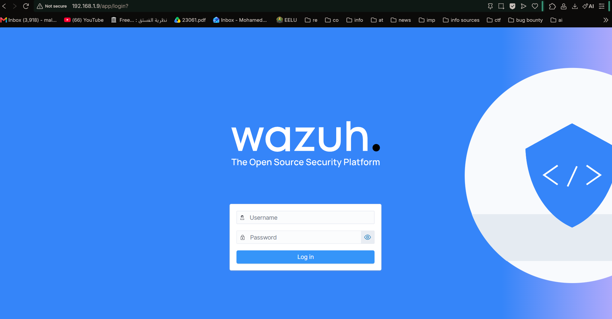<br>
      <sub><strong>02 · Web Console Authentication</strong><br>Initial administrative login into the Wazuh WUI dashboard.</sub>
    </td>
  </tr>
  <tr>
    <td align="center">
      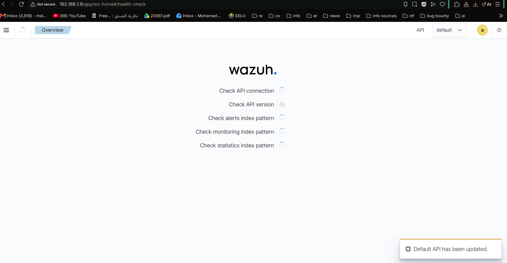<br>
      <sub><strong>03 · Operational Dashboard</strong><br>Wazuh security overview confirming active manager services.</sub>
    </td>
    <td align="center">
      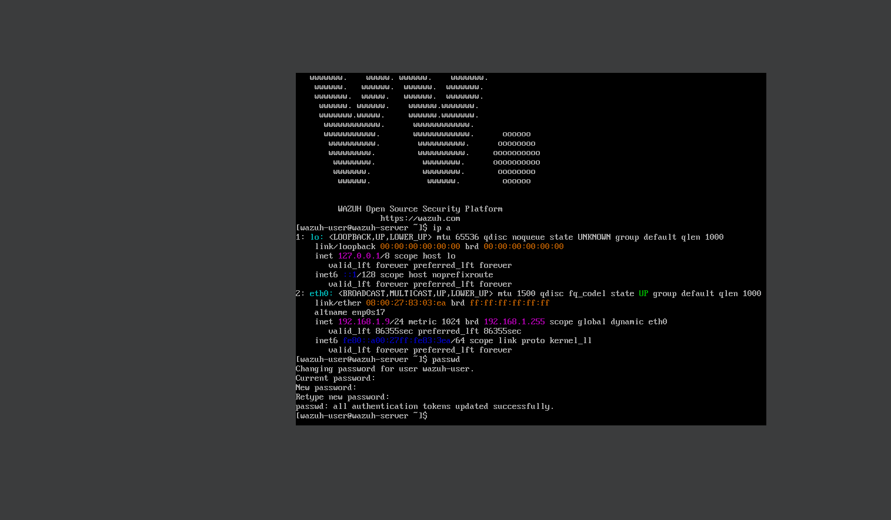<br>
      <sub><strong>04 · Security Hardening</strong><br>Rotating default administrative credentials on first deployment.</sub>
    </td>
  </tr>
</table>

---

### 2. Zero-Trust Tailscale Mesh Setup
<table>
  <tr>
    <td width="50%" align="center">
      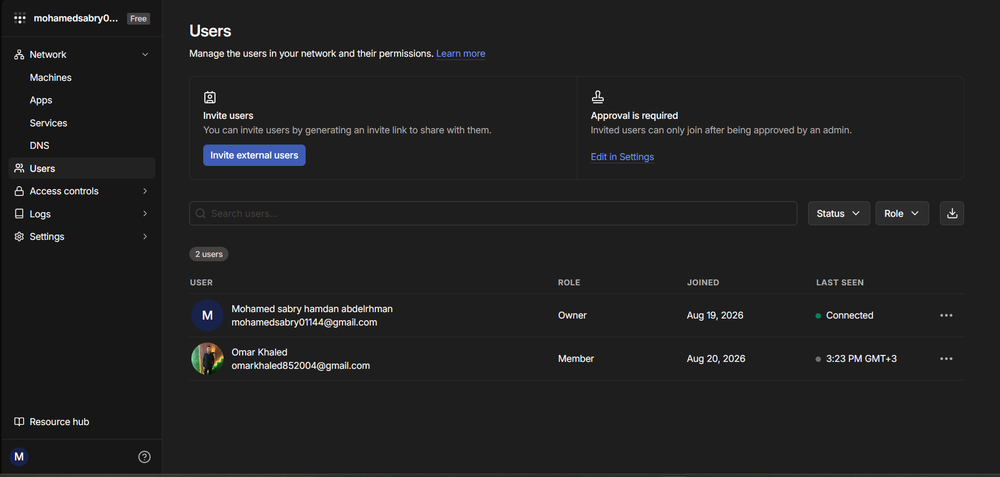<br>
      <sub><strong>05 · Zero-Trust Device Onboarding</strong><br>Owner-approved Tailscale mesh invites distributed to lab contributors.</sub>
    </td>
    <td width="50%" align="center">
      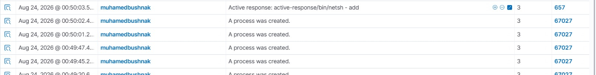<br>
      <sub><strong>06 · Connected Tailnet Mesh</strong><br>All 5 distributed machines online and reachable on flat 100.x subnet.</sub>
    </td>
  </tr>
</table>

---

### 3. Endpoint Enrollment & Monitoring
<table>
  <tr>
    <td width="50%" align="center">
      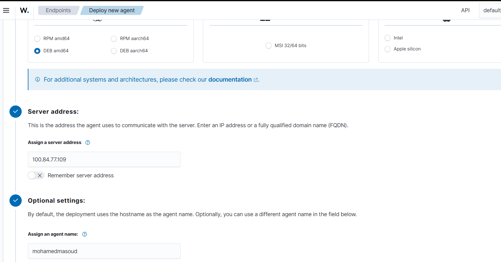<br>
      <sub><strong>07 · Windows 11 Agent Enrollment</strong><br>Registering Karim's Windows endpoint against manager Tailscale IP.</sub>
    </td>
    <td width="50%" align="center">
      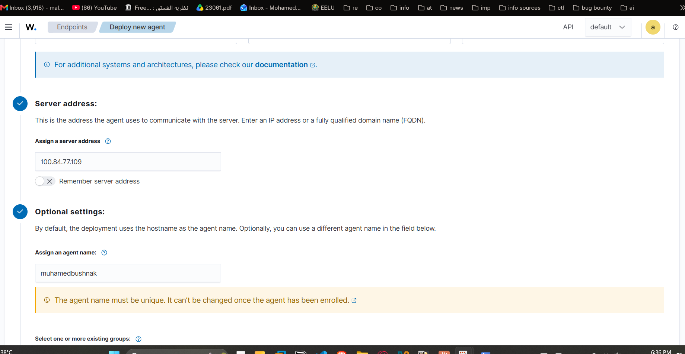<br>
      <sub><strong>08 · Windows Server 2022 Enrollment</strong><br>Enrolling Mohamed Bushnak's Windows Server target machine.</sub>
    </td>
  </tr>
  <tr>
    <td align="center">
      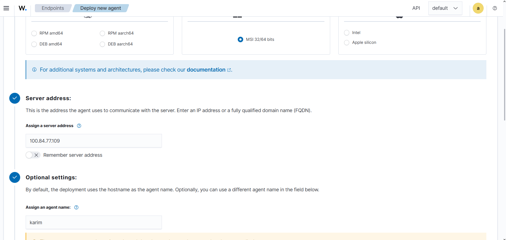<br>
      <sub><strong>09 · Windows Agent Configuration</strong><br>Configuring server address and secure registration parameters.</sub>
    </td>
    <td align="center">
      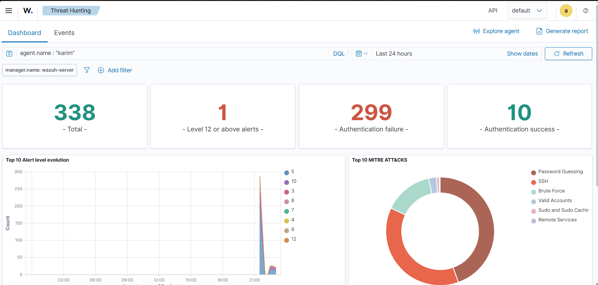<br>
      <sub><strong>10 · Live Agent Telemetry Verification</strong><br>Filtering events from agent 'karim' in Wazuh Threat Hunting.</sub>
    </td>
  </tr>
</table>

---

### 4. Red-Team Attack Simulation
<table>
  <tr>
    <td width="50%" align="center">
      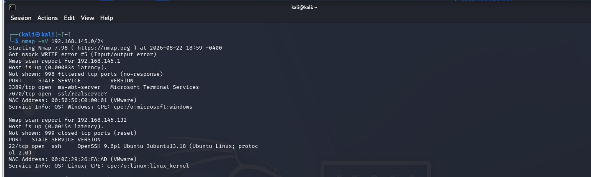<br>
      <sub><strong>11 · SSH Reconnaissance (Massoud Target)</strong><br>Nmap service scanning identifying open SSH daemon on Ubuntu.</sub>
    </td>
    <td width="50%" align="center">
      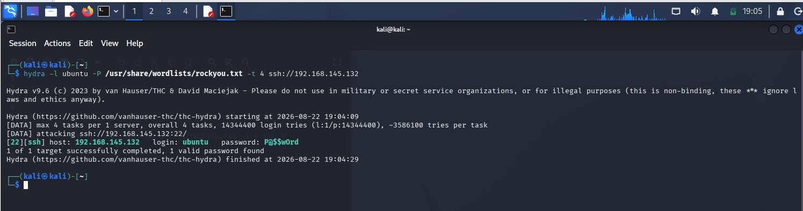<br>
      <sub><strong>12 · Hydra Brute-Force Attack</strong><br>High-speed dictionary attack guessing SSH credentials on victim host.</sub>
    </td>
  </tr>
  <tr>
    <td align="center">
      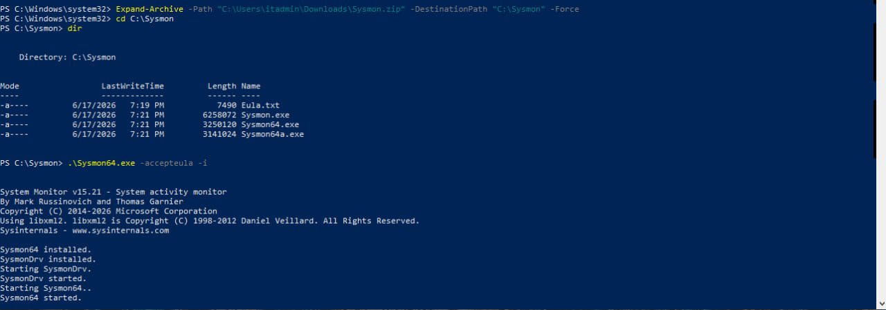<br>
      <sub><strong>13 · PowerShell ExecutionPolicy Bypass</strong><br>Bypassing script restrictions on Windows 11 endpoint (Karim).</sub>
    </td>
    <td align="center">
      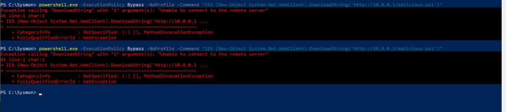<br>
      <sub><strong>14 · In-Memory Download Cradle</strong><br>IEX / DownloadString cradle triggering remote malicious payload fetch.</sub>
    </td>
  </tr>
</table>

---

### 5. Wazuh Real-Time Threat Detections
<table>
  <tr>
    <td width="50%" align="center">
      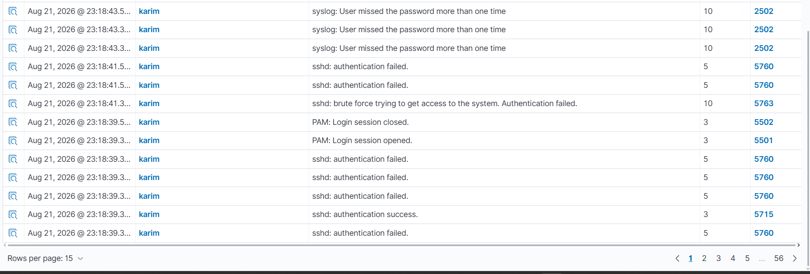<br>
      <sub><strong>15 · SSH Brute Force Detection</strong><br>Rule 5763 triggered following threshold of repeated failed logins.</sub>
    </td>
    <td width="50%" align="center">
      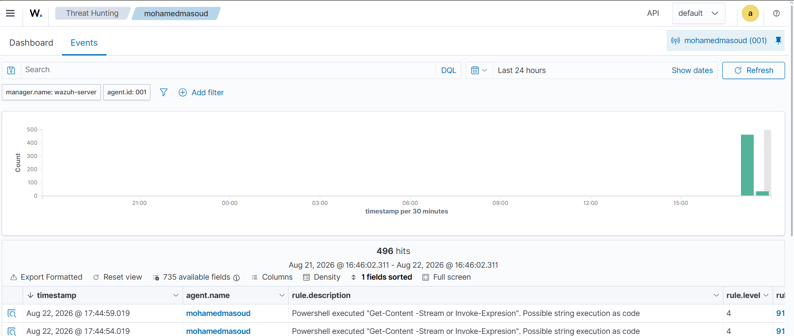<br>
      <sub><strong>16 · Suspicious PowerShell Detection</strong><br>Rule 91837 capturing IEX download cradle in script block logs.</sub>
    </td>
  </tr>
  <tr>
    <td colspan="2" align="center">
      <br>
      <sub><strong>17 · Command & Control Service Creation Detection</strong><br>Rule 92650 (Level 12) detecting dynamic service creation on Windows Server target (Bushnak).</sub>
    </td>
  </tr>
</table>

---

### 6. Shuffle SOAR & VirusTotal Integration
<table>
  <tr>
    <td width="50%" align="center">
      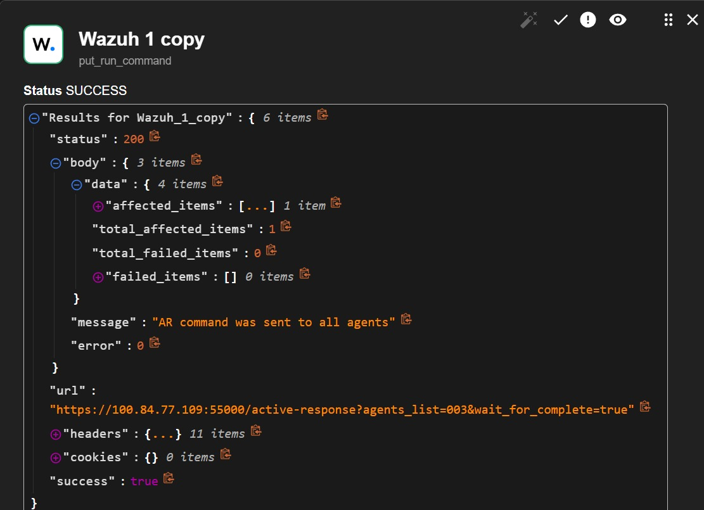<br>
      <sub><strong>18 · Complete SOAR Playbook Canvas</strong><br>Shuffle workflow designed by Omar Khaled with branching logic.</sub>
    </td>
    <td width="50%" align="center">
      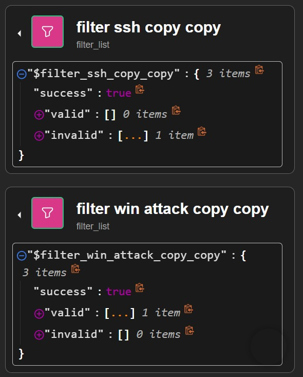<br>
      <sub><strong>19 · VirusTotal Threat Intel Node</strong><br>Automated reputation query for extracted external indicators.</sub>
    </td>
  </tr>
  <tr>
    <td align="center">
      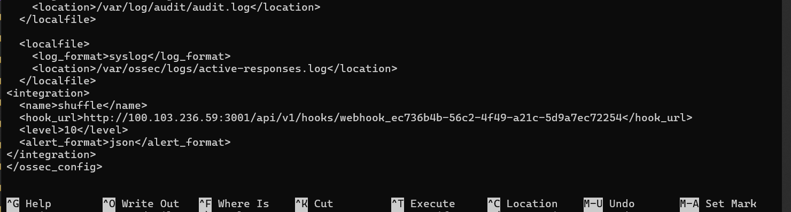<br>
      <sub><strong>20 · Wazuh Webhook Integration Block</strong><br>Configuration in ossec.conf routing qualifying rules to Shuffle.</sub>
    </td>
    <td align="center">
      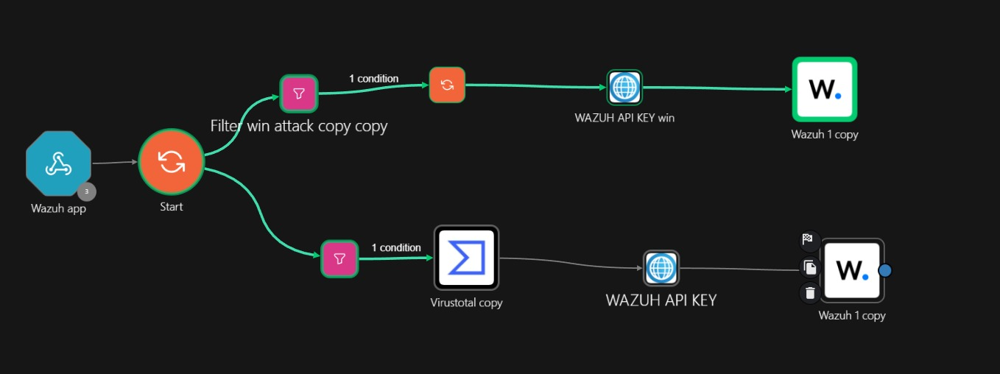<br>
      <sub><strong>21 · Wazuh REST API Authentication</strong><br>Shuffle obtaining JWT bearer token to execute containment.</sub>
    </td>
  </tr>
</table>

---

### 7. Active Response & Host Containment
<div align="center">
  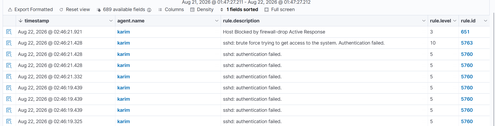<br>
  <sub><strong>22 · Active Response Execution & Host Isolation</strong><br>Wazuh active-response daemon executing netsh containment rule on Windows endpoint following repeated suspicious script executions.</sub>
</div>

---

## 🚀 Quick Start & Reproduction

### 1. Clone the Repository
```bash
git clone https://github.com/0xsabry/wazuh-shuffle-soar-soc-lab.git
cd wazuh-shuffle-soar-soc-lab
```

### 2. Review Sanitized Configurations
- **Wazuh Manager Config**: [`configs/ossec.conf`](configs/ossec.conf)
- **Custom Detection Rules**: [`configs/rules/local_rules.xml`](configs/rules/local_rules.xml)
- **Shuffle SOAR Playbook**: [`configs/shuffle/soc_automated_response_workflow.json`](configs/shuffle/soc_automated_response_workflow.json)
- **Containment Scripts**: [`configs/scripts/`](configs/scripts/)

### 3. Deploy the Lab
Follow our comprehensive step-by-step guides in the `docs/` directory:
- [📖 Full Architecture Guide](docs/ARCHITECTURE.md)
- [📖 Attack Execution Playbooks](docs/ATTACK_SCENARIOS.md)
- [📖 Detection Engineering & MITRE Mapping](docs/DETECTION_ENGINEERING.md)
- [📖 SOAR Automation & Playbooks](docs/SOAR_PLAYBOOKS.md)
- [📖 Complete Lab Setup Guide](docs/LAB_SETUP_GUIDE.md)

---

## 📂 Repository Structure

```text
.
├── .github/
│   └── workflows/
│       └── ci.yml                         # Automated CI pipeline for link & schema checks
├── assets/
│   ├── animations/
│   │   ├── banner-animated.svg            # Animated cyber SOC header banner
│   │   ├── architecture-flow.svg          # Animated network architecture diagram
│   │   ├── threat-response-loop.svg       # Animated 6-stage response pipeline
│   │   └── terminal-simulation.svg        # Animated real-time SOC analyst terminal
│   └── images/                            # Categorized high-resolution evidence gallery
│       ├── 01_wazuh_manager_deployment/
│       ├── 02_tailscale_mesh_network/
│       ├── 03_agent_enrollments/
│       ├── 04_attack_simulations/
│       ├── 05_wazuh_detections/
│       ├── 06_shuffle_soar_automation/
│       └── 07_active_response_containment/
├── configs/
│   ├── ossec.conf                         # Wazuh Manager config with Shuffle Webhook
│   ├── rules/
│   │   └── local_rules.xml                # Custom SSH, PowerShell, and C2 rules
│   ├── shuffle/
│   │   └── soc_automated_response_workflow.json # Importable Shuffle SOAR workflow schema
│   └── scripts/
│       ├── firewall-drop.sh               # Linux iptables Active Response script
│       └── netsh-isolate.cmd              # Windows firewall isolation script
├── docs/
│   ├── ARCHITECTURE.md                    # In-depth architectural documentation
│   ├── ATTACK_SCENARIOS.md                # Offensive simulation playbooks
│   ├── DETECTION_ENGINEERING.md           # Rule correlation & MITRE mapping
│   ├── SOAR_PLAYBOOKS.md                  # Shuffle automation & JWT API guide
│   └── LAB_SETUP_GUIDE.md                 # Complete reproduction instructions
├── .gitignore                             # Git ignore rules
├── LICENSE                                # MIT Open Source License
├── CONTRIBUTING.md                        # Contribution guidelines
├── SECURITY.md                            # Responsible disclosure policy
└── README.md                              # Flagship repository documentation
```

---

## 👨‍💻 Author & Credits

**Mohamed Sabry** · SOC Analyst & DFIR Specialist  
- 🐙 GitHub: [@0xsabry](https://github.com/0xsabry)  
- 💼 LinkedIn: [Mohamed Sabry](https://www.linkedin.com/in/mohamed-sabry-hamdan/)  
- 📧 Email: `2201381@student.eelu.edu.eg`

### Team Contributors
- **Omar Khaled** — Shuffle SOAR Automation & Workflow Architecture
- **Mohamed Massoud** — Linux Monitored Target & SSH Brute-Force Simulation
- **Karim** — Windows Monitored Target & PowerShell Payload Simulation
- **Mohamed Bushnak** — Windows Server Target & C2 Service Creation Simulation

---

<div align="center">
  <sub>Built with pride for academic research & cybersecurity portfolio excellence · August 2026</sub><br>
  <sub>⭐ If you find this project helpful, please consider giving it a star on GitHub! ⭐</sub>
</div>
