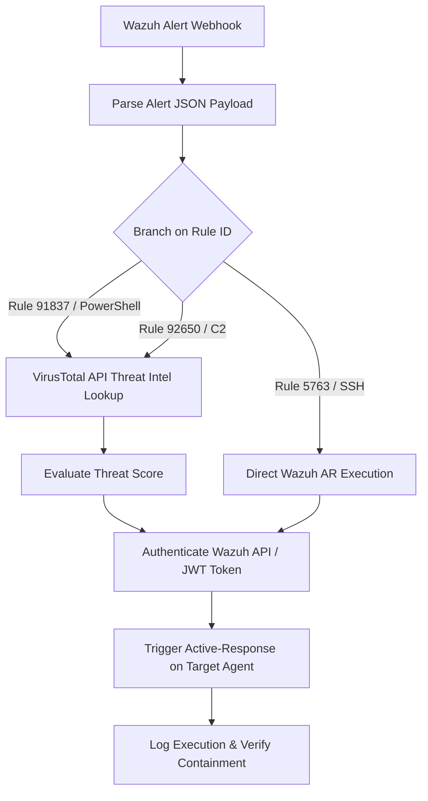

# SOAR Playbooks & Automation Workflows

Technical breakdown of Shuffle SOAR workflow pipelines, API authentication flows, and automated containment actions.

---

## 1. Playbook Workflow Architecture

The Shuffle SOAR automation engine (`shuffle-soar` running on Docker at `100.64.0.14:3001`) receives alerts from Wazuh via webhook and orchestrates enrichment, decision branching, and automated active-response execution.



---

## 2. Inbound Webhook Payload Schema

When a qualifying rule triggers, Wazuh posts the following structured JSON to Shuffle:

```json
{
  "timestamp": "2026-08-24T00:50:31.142+0000",
  "rule": {
    "level": 10,
    "description": "sshd: Maximum authentication attempts exceeded",
    "id": "5763",
    "mitre": {
      "id": ["T1110.001"]
    }
  },
  "agent": {
    "id": "002",
    "name": "mohamedmassoud",
    "ip": "100.64.0.11"
  },
  "data": {
    "srcip": "192.168.1.105",
    "dstuser": "massoud",
    "protocol": "ssh"
  }
}
```

---

## 3. Threat Intel Enrichment: VirusTotal API v3

For suspicious payloads, script blocks, or external domains/IPs, Shuffle executes an automated lookup via VirusTotal API:

- **Endpoint**: `https://www.virustotal.com/api/v3/ip_addresses/{ip}`
- **Header**: `x-apikey: ${VIRUSTOTAL_API_KEY}`
- **Extracted Attributes**:
  - `last_analysis_stats.malicious`
  - `last_analysis_stats.suspicious`
  - `reputation`
  - `as_owner` (Autonomous System Name)

If the malicious detection threshold is $> 0$ or matches high-risk heuristics, the playbook automatically elevates the containment priority.

---

## 4. Bi-Directional Wazuh API Callback & JWT Authentication

To execute active containment programmatically, Shuffle performs an authenticated REST API call back to the Wazuh Manager:

### Step 1: JWT Authentication
```bash
curl -u wazuh-api-user:StrongPassword! -k -X POST https://100.64.0.10:55000/security/user/authenticate
```
*Response*:
```json
{
  "data": {
    "token": "eyJhbGciOiJIUzI1NiIsInR5cCI6IkpXVCJ9..."
  }
}
```

### Step 2: Trigger Active-Response Command
```bash
curl -k -X PUT https://100.64.0.10:55000/active-response \
  -H "Authorization: Bearer <JWT_TOKEN>" \
  -H "Content-Type: application/json" \
  -d '{
    "command": "firewall-drop0",
    "custom": false,
    "agent_list": ["002"],
    "arguments": ["-192.168.1.105"]
  }'
```

*Execution Latency*: **$< 1.5$ seconds** from initial alert receipt to active endpoint containment.
